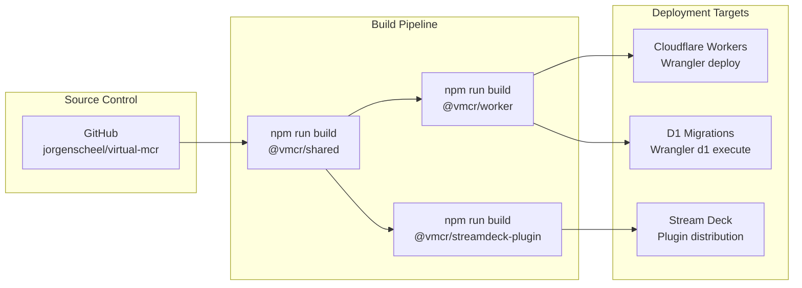
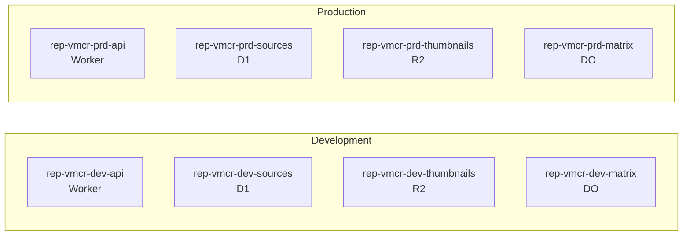

# Virtual MCR — Implementation & Deployment Viewpoint

> **ArchiMate viewpoint:** Implementation & Deployment
> **Scope:** Build pipeline, deployment, environments, and secrets
> **Last updated:** 2026-02-03

## Purpose

Documents the build pipeline, deployment targets, environment strategy, and secrets management for the Virtual MCR system.

## Deployment Pipeline



## Build Order

Packages must be built in dependency order because `@vmcr/shared` exports TypeScript declarations consumed by the other packages.

```
1. @vmcr/shared       → tsc → dist/ (declarations + ESM)
2. @vmcr/worker       → wrangler → V8 bundle (consumes shared)
3. @vmcr/streamdeck-plugin → rollup → bin/plugin.js (consumes shared)
```

### Build Commands

```bash
# Full build (dependency order)
npm run build --workspace=packages/shared
npm run build --workspace=packages/worker
npm run build --workspace=packages/streamdeck-plugin

# Or from root (builds all workspaces)
npm run build
```

## Environment Strategy

| Environment | Suffix | Purpose | Deployment |
|-------------|--------|---------|------------|
| Development | `dev` | Local development with `wrangler dev` | Automatic on `npm run dev` |
| Production | `prd` | Live system serving Stream Deck clients | Manual via `wrangler deploy` |

### Resource Naming per Environment

Following the EA naming convention `rep-vmcr-{env}-{component}`:



## Secrets Management

| Secret | Scope | How to Set |
|--------|-------|------------|
| `API_KEY` | Worker | `wrangler secret put API_KEY` |
| `INTINOR_API_KEY` | Worker (Phase 3) | `wrangler secret put INTINOR_API_KEY` |
| `INTINOR_HOST` | Worker (Phase 3) | `wrangler secret put INTINOR_HOST` |

Secrets are **never** committed to the repository. The `.gitignore` excludes `.dev.vars` (local development secrets) and `.env*` files.

### Local Development Secrets

Create `packages/worker/.dev.vars` (gitignored):

```ini
API_KEY=your-development-api-key
```

## D1 Database Migrations

Migrations are stored in `packages/worker/migrations/` and applied in order.

| Migration | File | Description |
|-----------|------|-------------|
| 0001 | `0001_create_sources.sql` | Creates the `sources` table with id, name, protocol, connection, thumbnails |

### Applying Migrations

```bash
# Local development
wrangler d1 execute vmcr-sources --local --file=migrations/0001_create_sources.sql

# Production (after D1 database is created)
wrangler d1 execute vmcr-sources --file=migrations/0001_create_sources.sql
```

## Stream Deck Plugin Distribution

The Stream Deck plugin is distributed as a `.streamDeckPlugin` archive:

```
com.remoteproduction.vmcr.sdPlugin/
├── bin/plugin.js          ← Rollup bundle output
├── manifest.json          ← Plugin metadata and action definitions
├── imgs/                  ← Action icons (1x and 2x)
│   ├── plugin-icon.png
│   ├── category-icon.png
│   ├── select-source.png
│   ├── select-source@2x.png
│   ├── output-status.png
│   └── output-status@2x.png
└── ui/                    ← Property Inspector HTML
    ├── select-source-pi.html
    └── output-status-pi.html
```

### Installation

1. Build the plugin: `npm run build --workspace=packages/streamdeck-plugin`
2. Package the `.sdPlugin` directory
3. Install via Stream Deck application or CLI

## Wrangler Configuration

The `wrangler.toml` defines all Cloudflare bindings:

| Binding | Type | Name |
|---------|------|------|
| `DB` | D1 Database | `vmcr-sources` |
| `THUMBNAILS` | R2 Bucket | `vmcr-thumbnails` |
| `MATRIX_STATE` | Durable Object | `MatrixState` class |
| `ENVIRONMENT` | Variable | `development` (default) |
