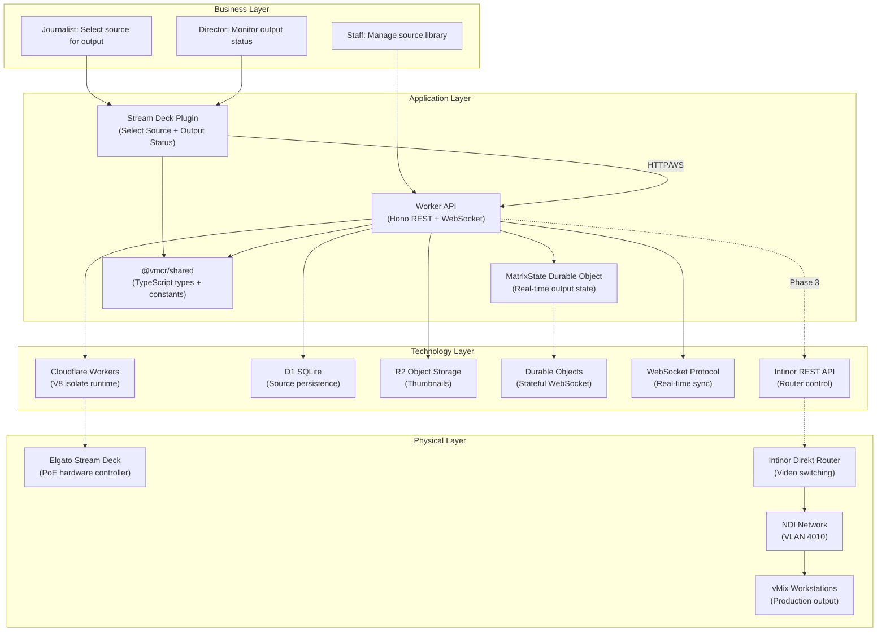

# Virtual MCR — Layered Viewpoint

> **ArchiMate viewpoint:** Layered
> **Scope:** Full system — business through physical
> **Last updated:** 2026-02-03

## Purpose

Shows the Virtual MCR system structure across four ArchiMate layers: Business, Application, Technology, and Physical. This viewpoint answers _"what does the system consist of and how do the layers depend on each other?"_

## System Layers

## Layer Descriptions

### Business Layer

| Actor | Process | Phase |
|-------|---------|-------|
| Journalist | Selects a video source to assign to an output using Stream Deck buttons | 1 |
| Staff | Manages the source library — creates, updates, and deletes sources via API | 1 |
| Director | Monitors which sources are active on each output via Stream Deck display | 1 |

### Application Layer

| Component | Responsibility | Package |
|-----------|---------------|---------|
| Stream Deck Plugin | Hardware button actions, WebSocket state display, SVG rendering | `@vmcr/streamdeck-plugin` |
| Worker API | REST endpoints for sources/outputs, auth middleware, thumbnail storage | `@vmcr/worker` |
| MatrixState DO | Singleton Durable Object holding output→source assignments, broadcasting changes | `@vmcr/worker` |
| Shared Types | TypeScript interfaces and constants shared across all packages | `@vmcr/shared` |

### Technology Layer

| Service | Purpose | Binding |
|---------|---------|---------|
| Cloudflare Workers | Serverless compute (V8 isolates) | — |
| D1 SQLite | Source metadata persistence | `DB` |
| R2 Object Storage | Thumbnail image blobs | `THUMBNAILS` |
| Durable Objects | Stateful singleton for matrix state + WebSocket | `MATRIX_STATE` |
| WebSocket | Real-time output change notifications | via DO |
| Intinor REST API | Video router parameter control (Phase 3) | External |

### Physical Layer

| Equipment | Network | Role |
|-----------|---------|------|
| Elgato Stream Deck (PoE) | Control VLAN 1513 | User input hardware |
| Intinor Direkt Router | Control VLAN 1513 + NDI VLAN 4010 | Video source switching |
| NDI network | VLAN 4010 | Low-latency video transport |
| vMix workstations | NDI VLAN 4010 | Production rendering |
