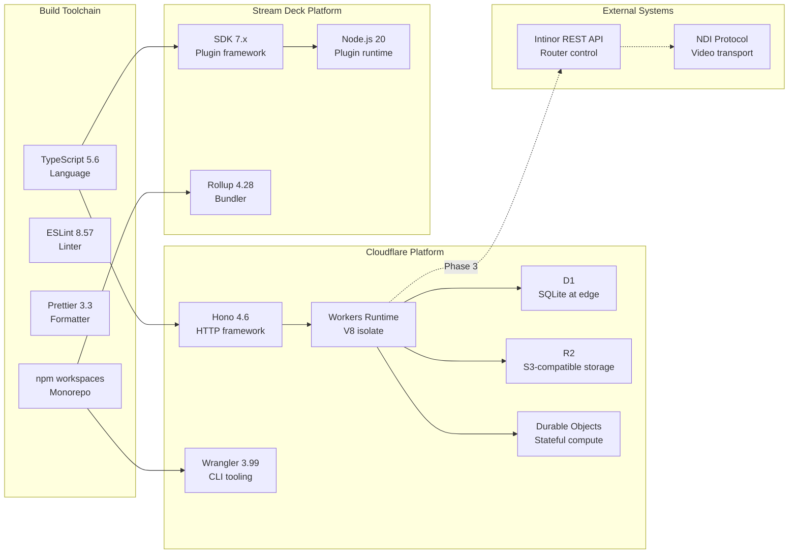

# Virtual MCR — Technology Viewpoint

> **ArchiMate viewpoint:** Technology
> **Scope:** Platform, frameworks, and tooling
> **Last updated:** 2026-02-03

## Purpose

Documents the technology stack, version constraints, and EA naming conventions for all Virtual MCR components.

## Technology Stack



## Version Matrix

| Component | Version | Constraint |
|-----------|---------|------------|
| Node.js | 20.x LTS | Engine requirement in `package.json` |
| TypeScript | 5.6.0 | ES2022 target, bundler module resolution |
| Hono | 4.6.x | Cloudflare Workers adapter |
| Wrangler | 3.99.x | D1, R2, DO bindings |
| @elgato/streamdeck | 7.x | SDK with action-based architecture |
| Rollup | 4.28.x | Plugin JS bundling |
| ESLint | 8.57.x | @typescript-eslint parser |
| Prettier | 3.3.x | Single quotes, trailing commas |

## EA Naming Convention

All Cloudflare resources follow the enterprise naming standard:

```
rep-vmcr-{env}-{component}
```

| Resource | Development | Production |
|----------|-------------|------------|
| Worker | `rep-vmcr-dev-api` | `rep-vmcr-prd-api` |
| D1 database | `rep-vmcr-dev-sources` | `rep-vmcr-prd-sources` |
| R2 bucket | `rep-vmcr-dev-thumbnails` | `rep-vmcr-prd-thumbnails` |
| DO namespace | `rep-vmcr-dev-matrix` | `rep-vmcr-prd-matrix` |
| Tunnel | `rep-vmcr-dev-tunnel` | `rep-vmcr-prd-tunnel` |

**Prefix breakdown:**
- `rep` — Remote Production (organization unit)
- `vmcr` — Virtual MCR (project)
- `dev`/`prd` — environment
- suffix — component name

## Configuration Files

| File | Purpose |
|------|---------|
| `tsconfig.base.json` | Shared TypeScript config (ES2022, strict, declarations) |
| `.eslintrc.json` | Linting rules (recommended + @typescript-eslint) |
| `.prettierrc` | Code formatting (semi, singleQuote, trailingComma: all) |
| `package.json` | Root workspace definition, shared devDependencies |
| `wrangler.toml` | Cloudflare Workers bindings and deployment config |
| `rollup.config.mjs` | Stream Deck plugin bundler config |

## Module Resolution

```
@vmcr/shared    → packages/shared/dist/index.js    (ESM, declarations)
@vmcr/worker    → packages/worker/src/index.ts      (Wrangler bundled)
@vmcr/streamdeck-plugin → packages/streamdeck-plugin/src/plugin.ts (Rollup bundled)
```

All packages use `"type": "module"` with `.js` extensions in import paths for TypeScript ESM compatibility.
