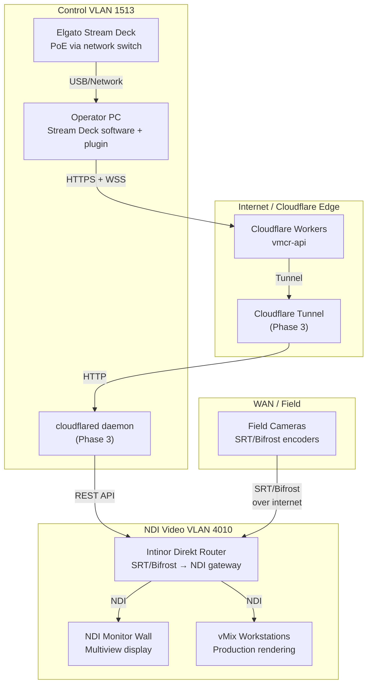
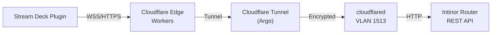

# Virtual MCR — Physical Viewpoint

> **ArchiMate viewpoint:** Physical
> **Scope:** Network topology, VLANs, equipment, and protocols
> **Last updated:** 2026-02-03

## Purpose

Documents the physical network topology showing how the Virtual MCR system connects through Cloudflare's edge, the control VLAN, and the NDI video VLAN to the production equipment.

## Network Topology

## VLAN Architecture

| VLAN ID | Name | Purpose | Subnet | Multicast |
|---------|------|---------|--------|-----------|
| 4010 | NDI Video | Low-latency video transport (NDI) | 10.40.10.0/24 | Enabled (IGMP snooping) |
| 1513 | Control | Management, API, monitoring | 10.15.13.0/24 | Disabled |

### VLAN Separation Rationale

- **VLAN 4010** carries high-bandwidth NDI multicast traffic. IGMP snooping is enabled on managed switches to prevent flooding.
- **VLAN 1513** carries control-plane traffic: Cloudflare Tunnel, Intinor REST API, monitoring. Isolated from video to prevent congestion impacting control responsiveness.

## Equipment Inventory

| Equipment | Location | VLAN | Role |
|-----------|----------|------|------|
| Elgato Stream Deck (PoE) | Control room | 1513 | Physical button interface for operators |
| Operator PC | Control room | 1513 | Runs Stream Deck software + plugin |
| Intinor Direkt Router | Equipment rack | 1513 + 4010 | Video source switching, protocol gateway |
| NDI monitor wall | Control room | 4010 | Multiview monitoring of all sources |
| vMix workstations | Control room | 4010 | Production rendering and output |
| Managed switch (ProAV) | Equipment rack | Trunk | VLAN trunking, IGMP snooping, QoS |
| cloudflared host | Equipment rack | 1513 | Cloudflare Tunnel endpoint (Phase 3) |

## Protocol Decision Matrix

| Protocol | Direction | Use Case | Latency | Bandwidth |
|----------|-----------|----------|---------|-----------|
| **SRT** | WAN → Intinor | Field camera contribution over internet | 200–500 ms | 5–20 Mbps |
| **Bifrost** | WAN → Intinor | Intinor-native field contribution | 100–300 ms | 5–20 Mbps |
| **NDI** | LAN (VLAN 4010) | Studio video routing between devices | < 1 ms | 100–200 Mbps |
| **RTMP** | WAN → Intinor | Legacy encoder contribution | 500–2000 ms | 5–15 Mbps |
| **HLS** | CDN → viewers | Public viewing (out of scope) | 6–30 s | Variable |
| **RTP** | LAN → LAN | Point-to-point low-latency (niche) | < 1 ms | 50–200 Mbps |

### Protocol Selection Guidelines

1. **Field → Intinor:** Prefer Bifrost for Intinor-native devices, SRT for third-party encoders
2. **Intinor → Studio:** Always NDI on VLAN 4010
3. **Studio internal:** NDI for all routing between vMix, monitors, and replay systems
4. **Control:** HTTPS/WSS from Stream Deck plugin to Cloudflare Workers; REST from Tunnel to Intinor

## Cloudflare Tunnel Architecture (Phase 3)

The tunnel enables the Workers backend to reach the on-premises Intinor Router REST API without exposing the router to the public internet. The `cloudflared` daemon runs on VLAN 1513 and proxies authenticated requests from the Worker.
