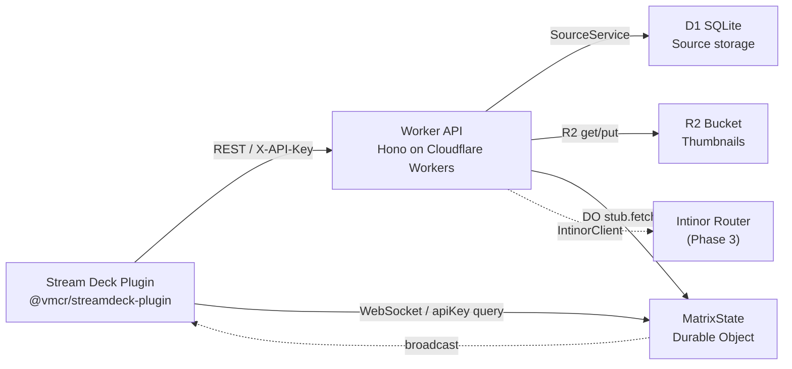
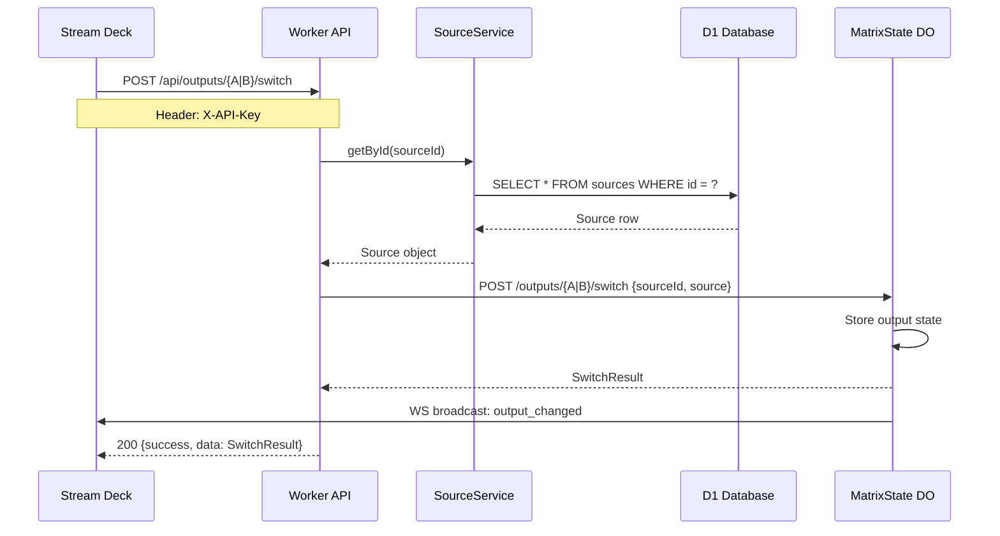
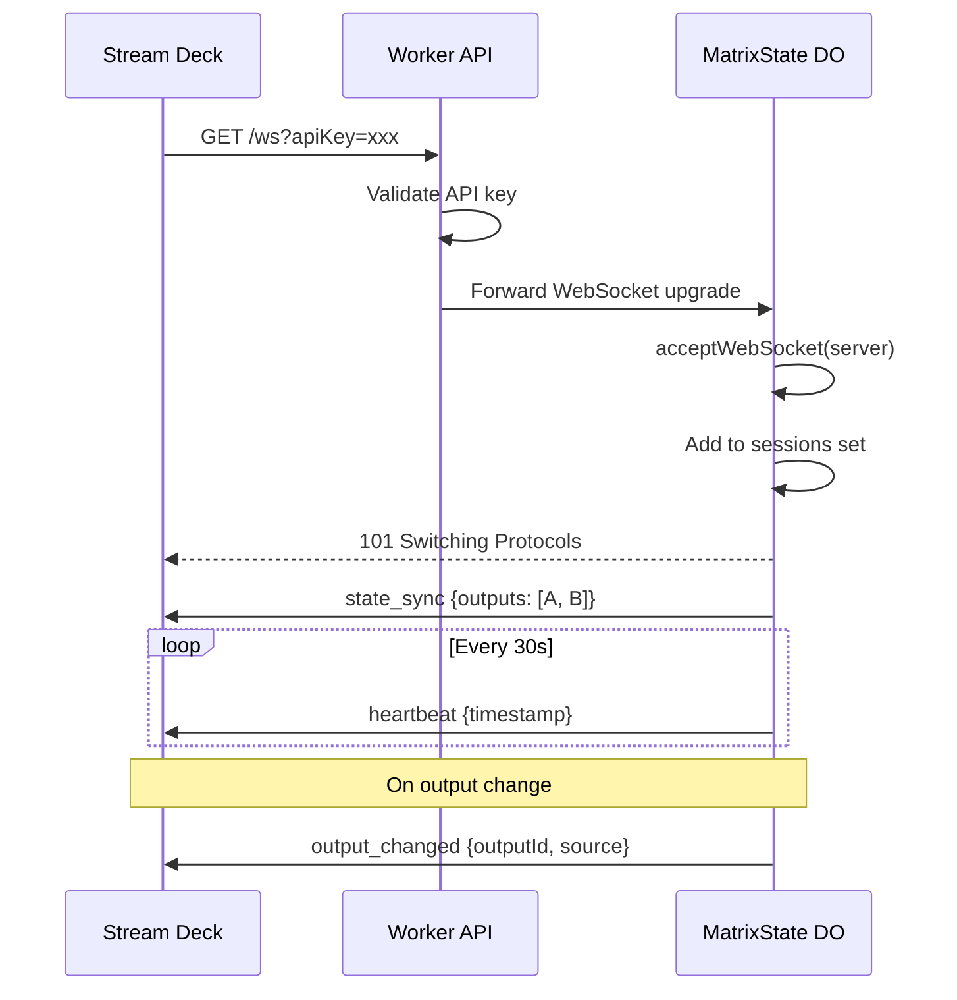
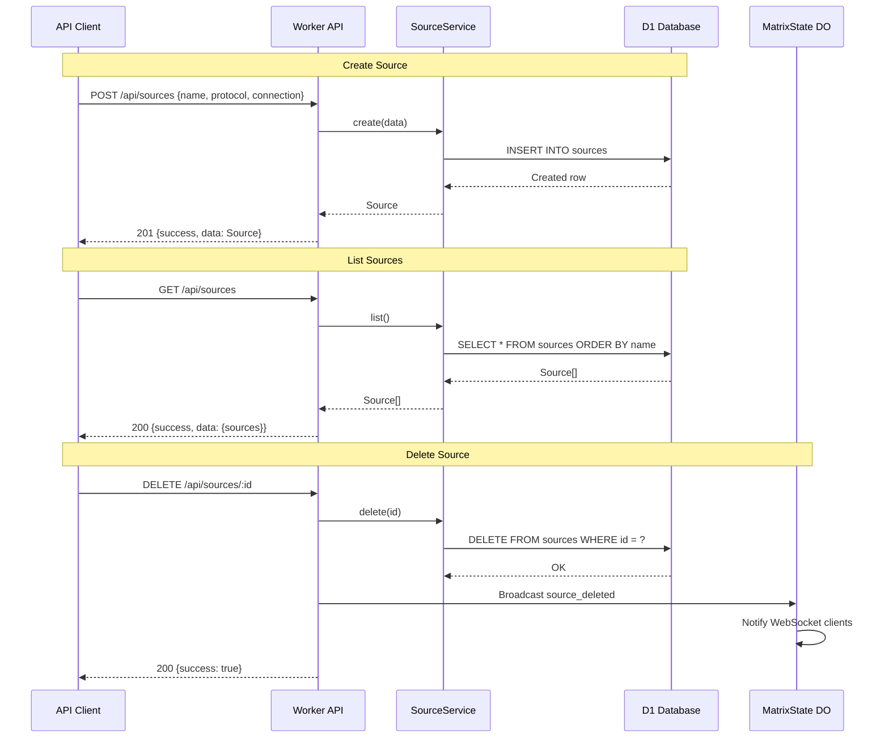

# Virtual MCR — Application Cooperation Viewpoint

> **ArchiMate viewpoint:** Application Cooperation
> **Scope:** Service interactions and API contracts
> **Last updated:** 2026-02-03

## Purpose

Shows how the application components interact through APIs, WebSocket, and internal service calls. Documents the key interaction flows and the full API endpoint catalog.

## Service Map

## Interaction Flows

### 1. Source Switch Flow

### 2. WebSocket Connection Flow

### 3. Source CRUD Flow

## API Endpoint Catalog

### Authentication

All endpoints except `/api/health` require the `X-API-Key` header. WebSocket connections accept `apiKey` as a query parameter.

### Endpoints

| Method | Path | Description | Request Body | Response |
|--------|------|-------------|-------------|----------|
| `GET` | `/api/health` | Health check (no auth) | — | `{status, timestamp}` |
| `GET` | `/api/sources` | List all sources | — | `{sources: Source[]}` |
| `POST` | `/api/sources` | Create source | `CreateSourceRequest` | `Source` |
| `GET` | `/api/sources/:id` | Get source by ID | — | `Source` |
| `PUT` | `/api/sources/:id` | Update source | `UpdateSourceRequest` | `Source` |
| `DELETE` | `/api/sources/:id` | Delete source | — | `{success: true}` |
| `GET` | `/api/sources/:id/thumbnail` | Get thumbnail image | — | `image/png` binary |
| `PUT` | `/api/sources/:id/thumbnail` | Upload thumbnail | Binary image body | `{sourceId, contentType}` |
| `GET` | `/api/outputs` | Get all output statuses | — | `{outputs: OutputStatus[]}` |
| `GET` | `/api/outputs/:id` | Get single output status | — | `OutputStatus` |
| `POST` | `/api/outputs/:id/switch` | Switch output source | `SwitchRequest` | `SwitchResult` |
| `GET` | `/ws` | WebSocket upgrade | — | `101` + state_sync |

### WebSocket Message Types

| Type | Direction | Payload |
|------|-----------|---------|
| `state_sync` | Server → Client | `{outputs: OutputStatus[]}` |
| `output_changed` | Server → Client | `{outputId, previousSourceId, newSourceId, source}` |
| `source_updated` | Server → Client | `{source: Source}` |
| `source_deleted` | Server → Client | `{sourceId: string}` |
| `heartbeat` | Server → Client | `{timestamp}` |
