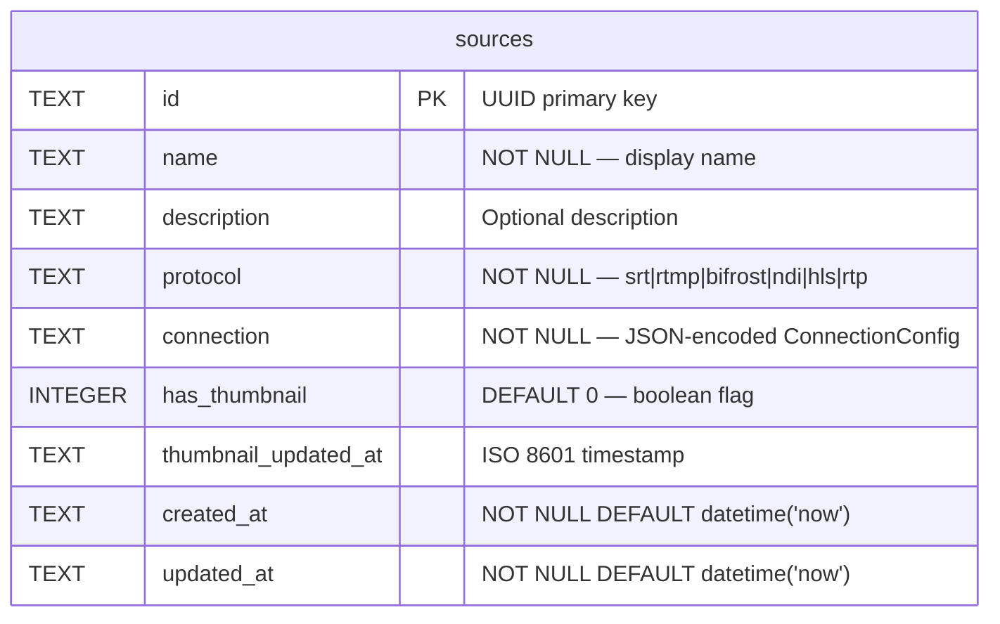
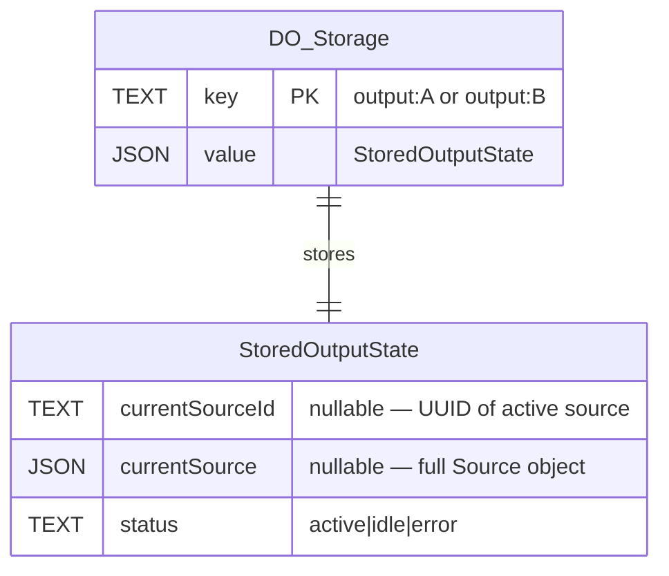
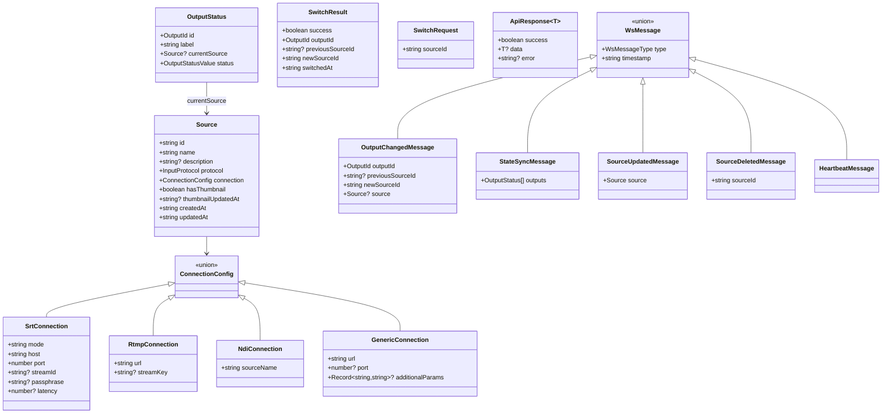

# Virtual MCR — Information Structure Viewpoint

> **ArchiMate viewpoint:** Information Structure
> **Scope:** Data models, persistence schemas, and type hierarchy
> **Last updated:** 2026-02-03

## Purpose

Documents the data structures used across the Virtual MCR system: D1 relational schema, Durable Object key-value storage, R2 object layout, and the TypeScript type hierarchy shared between packages.

## D1 Database Schema



### Column Details

| Column | Type | Constraints | Notes |
|--------|------|-------------|-------|
| `id` | TEXT | PRIMARY KEY | UUID v4, generated at insert |
| `name` | TEXT | NOT NULL | Human-readable source name |
| `description` | TEXT | nullable | Optional description |
| `protocol` | TEXT | NOT NULL | One of: `srt`, `rtmp`, `bifrost`, `ndi`, `hls`, `rtp` |
| `connection` | TEXT | NOT NULL | JSON string — discriminated by `protocol` |
| `has_thumbnail` | INTEGER | DEFAULT 0 | 0 = no thumbnail, 1 = has thumbnail in R2 |
| `thumbnail_updated_at` | TEXT | nullable | ISO 8601 timestamp of last thumbnail upload |
| `created_at` | TEXT | NOT NULL | Auto-set on insert |
| `updated_at` | TEXT | NOT NULL | Updated on every mutation |

## Durable Object Storage

The `MatrixState` Durable Object uses key-value storage with the following structure:



### Keys

| Key | Value Type | Description |
|-----|-----------|-------------|
| `output:A` | `StoredOutputState` | Current state of Output A |
| `output:B` | `StoredOutputState` | Current state of Output B |

## R2 Object Storage

Thumbnails are stored in the `vmcr-thumbnails` R2 bucket:

```
vmcr-thumbnails/
└── thumbnails/
    ├── {source-uuid-1}     ← image/png or image/jpeg
    ├── {source-uuid-2}
    └── ...
```

| Property | Value |
|----------|-------|
| Key pattern | `thumbnails/{sourceId}` |
| Content-Type | Stored in `httpMetadata.contentType` |
| Cache-Control | `public, max-age=3600` (set on GET response) |
| ETag | Provided by R2 for conditional requests |

## TypeScript Type Hierarchy



## Type Definitions

### Enumerations

| Type | Values | Package |
|------|--------|---------|
| `InputProtocol` | `srt`, `rtmp`, `bifrost`, `ndi`, `hls`, `rtp` | `@vmcr/shared` |
| `OutputId` | `A`, `B` | `@vmcr/shared` |
| `OutputStatusValue` | `active`, `idle`, `error` | `@vmcr/shared` |
| `WsMessageType` | `output_changed`, `source_updated`, `source_deleted`, `heartbeat`, `state_sync` | `@vmcr/shared` |

### Request/Response Types

| Type | Used By | Direction |
|------|---------|-----------|
| `CreateSourceRequest` | `POST /api/sources` | Client → API |
| `UpdateSourceRequest` | `PUT /api/sources/:id` | Client → API |
| `SwitchRequest` | `POST /api/outputs/:id/switch` | Client → API |
| `ApiResponse<T>` | All endpoints | API → Client |
| `SourceListResponse` | `GET /api/sources` | API → Client |
| `SwitchResult` | `POST /api/outputs/:id/switch` | API → Client |

### Constants

| Constant | Value | Purpose |
|----------|-------|---------|
| `OUTPUT_LABELS` | `{A: "Output A", B: "Output B"}` | Display names |
| `OUTPUT_COLORS` | `{A: "#2196F3", B: "#FF9800"}` | UI color coding |
| `ACTIVE_COLOR` | `#4CAF50` | Active state indicator |
| `WS_HEARTBEAT_INTERVAL_MS` | `30000` | WebSocket keepalive interval |
| `WS_RECONNECT_DELAY_MS` | `3000` | Initial reconnect backoff |
| `WS_MAX_RECONNECT_DELAY_MS` | `30000` | Maximum reconnect backoff |
| `API_KEY_HEADER` | `X-API-Key` | Authentication header name |
